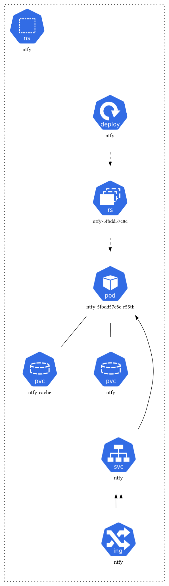

### ntfy

Runs a self hosted ntfy service in kubernetes cluster.

## Dependencies

- [just](https://github.com/casey/just)
- [kubectl](https://kubernetes.io/docs/tasks/tools/)
- [k8s viz](https://github.com/mkimuram/k8sviz)

## usage

This service uses `just` cli to manage the deployment.

```bash
just
# list individual recipes
just -l

# Available recipes:
#     convert
#     default
#     deploy
#     restart
#     viz
```

## viz


